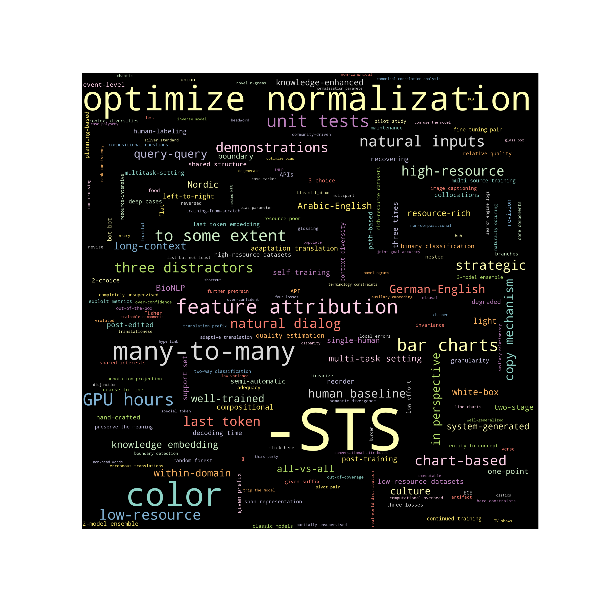

# Automated Keyword Search in ACL Anthology

### Introduction

This tool enables automated search for relevant papers with keywords in the [ACL Anthology](https://aclanthology.org). 

---

### Challenges

One key challenge is that the returned number is unstable. After multiple searches, the minimal number is the stable one. The multiple searches are realized by switching between the two search options ("Relevance" or "Year of Publication"). The clicks are automated by [chromedriver](https://chromedriver.chromium.org), so please check that the local chromedriver has the same version as the browser before running the script (version 103 for this initial commit).

Still, the results are not guaranteed to be correct, even when the number of searches is set to 10. For example, at 07/04/22 the number of "subreddit" papers should be 31. For multiple runs with 10 as the number, only 108 is returned.

In order to (1) provide enough time for searching and (2) space the clicks so that the script is not immediately identified as a bot, the average time for each query is now around 20 seconds. Also, between the searches there is a sleep of 5~10 seconds, sampled uniformly. When the script reports an error, you can manually open the webpage to see if a captcha is required. After submitting the captcha once by yourself, you should be able to run the script again.

The `output.txt` file saves the results from my [keyword logbook](https://kt2k01.github.io/posts/2022/07/keyword/).

---

### Experiments

The file would be updated regularly from 22/07/10. The initial test shows that the current strategy works for scraping a list of 42 keywords. 

In a later test with 358 keywords, the scraper fails at the following indices 9, 54, 99, 135, 180, 225, 270, 279, 291, 324, 353.

---

### TODO

Currently only the notebook version is available. Command line support would be added later.

---

### Word Cloud Visualization

This is a word cloud visualization of all results.

